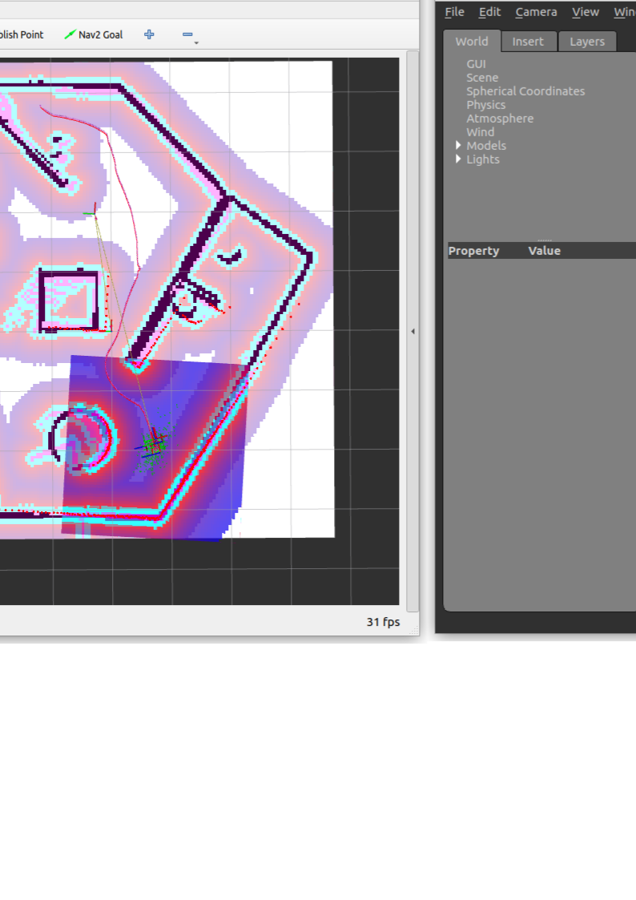

# Ros2TurtleSLAM Setup and Navigation Instructions

## SLAM Method

Simultaneous Localizatrion and Mapping (SLAM) is a method used to create map of unknown environment while simultaneously keeping thrack of the robot's location within that environment. In this project, we ise the TurtleBot3 robot and ROS 2 to perform SLAM in a simulated environment. 

This project sets up a TurtleBot3 robot in Gazebo and enables Simultaneous Localization and Mapping (SLAM) using Cartographer. The system also includes LIDAR-based motion control, manual teleoperation, and autonomous navigation based on a saved map.

## References 

This project follows setup instructions from this [Medium article](https://medium.com/@nilutpolkashyap/setting-up-turtlebot3-simulation-in-ros-2-humble-hawksbill-70a6fcdaf5de).

and navigation instructions  [ROS2 Navigation Tutorial](https://roboticsbackend.com/ros2-nav2-tutorial/) 


## Prerequisites

Before you begin, ensure you have the following installed:

1. **Ubuntu 22.04**: This project is tested on Ubuntu 22.04.

2. **ROS 2 Humble**: Install following the official ROS 2 installation guide:
    ```sh
    sudo apt update && sudo apt install ros-humble-desktop
    source /opt/ros/humble/setup.bash
    ```

3. **Gazebo Simulation Environment**:
    - If using Ignition Gazebo (Fortress) (recommended for ROS 2 Humble):
        ```sh
        sudo apt update
        sudo apt install ros-humble-gazebo-ros-pkgs
        ```
    - If using Classic Gazebo 11:
        ```sh
        sudo apt update
        sudo apt install gazebo11 ros-humble-gazebo-ros-pkgs
        ```

4. **Colcon Build Tool**: Install Colcon and its common extensions:
    ```sh
    sudo apt update
    sudo apt install python3-colcon-common-extensions
    ```

5. **RViz2**: Install RViz2 for ROS 2 Humble:
    ```sh
    sudo apt update
    sudo apt install ros-humble-rviz2
    ```


## Setup Packages

```sh
git clone git@github.com:msilaev/Ros2TurtleSLAM.git
cd Documents/Robotics/Ros2TurtleSLAM/ros2_ws
colcon build --symlink-install
```

## turtle3_world SLAM

<p align="center">
  
</p>

### Start Gazebo TurtleBot Simulation

```sh
pkill -9 ros2
pkill -9 gzclient
pkill -9 gzserver
pkill -9 robot_state_pub
pkill -9 lidarNode
cd Documents/Robotics/Ros2TurtleSLAM/ros2_ws
source install/setup.bash
export TURTLEBOT3_MODEL=waffle
ros2 launch turtlebot3_gazebo turtlebot3_world.launch.py
```

### Cartographer

```sh
cd Documents/Robotics/Ros2TurtleSLAM/ros2_ws
source install/setup.bash
export TURTLEBOT3_MODEL=waffle
ros2 launch turtlebot3_cartographer cartographer.launch.py use_sim_time:=True
```

### Motion Control Loop Controlled by LIDAR Sensor

```sh
cd Documents/Robotics/Ros2TurtleSLAM/ros2_ws
source install/setup.bash
pkill -9 lidarNode
ros2 run lidar_avoidance lidarNode
```

### Save Map

```sh
cd Documents/Robotics/Ros2TurtleSLAM/ros2_ws
ros2 run nav2_map_server map_saver_cli -f ./map
```

### If Robot is Stuck, Use Teleop

```sh
cd Documents/Robotics/Ros2TurtleSLAM/ros2_ws
source install/setup.bash
export TURTLEBOT3_MODEL=waffle
ros2 run turtlebot3_teleop teleop_keyboard
```

### Navigation Saved Map turtle3_world

To start navigation click in rvitz window "2D Pose Estimata", then "Nav2 Goal"
```sh
pkill -9 rvitz2
pkill -9 cartographer_no
pkill -9 cartographer_oc
source /usr/share/gazebo/setup.sh
cd Documents/Robotics/Ros2TurtleSLAM/ros2_ws
source install/setup.bash
export TURTLEBOT3_MODEL=waffle
ros2 launch turtlebot3_navigation2 navigation2.launch.py use_sim_time:=True map:=$HOME/Documents/Robotics/Ros2TurtleSLAM/map.yaml
```


## Custom World SLAM

### Start Gazebo TurtleBot Simulation

<p align="center">
  
</p>

```sh
pkill -9 ros2
pkill -9 gzclient
pkill -9 gzserver
pkill -9 robot_state_pub
pkill -9 lidarNode
source /usr/share/gazebo/setup.sh
cd Documents/Robotics/Ros2TurtleSLAM/ros2_ws
source install/setup.bash
export TURTLEBOT3_MODEL=waffle
ros2 launch turtlebot3_gazebo turtlebot3_custom_map.launch.py
```

### Navigation Saved Map 
To start navigation click in rvitz window "2D Pose Estimata", then "Nav2 Goal"
```sh
pkill -9 rvitz2
pkill -9 cartographer_no
pkill -9 cartographer_oc
source /usr/share/gazebo/setup.sh
cd Documents/Robotics/Ros2TurtleSLAM/ros2_ws
source install/setup.bash
export TURTLEBOT3_MODEL=waffle
ros2 launch turtlebot3_navigation2 navigation2.launch.py use_sim_time:=True map:=$HOME/Documents/Robotics/Ros2TurtleSLAM/map_custom.yaml
```
